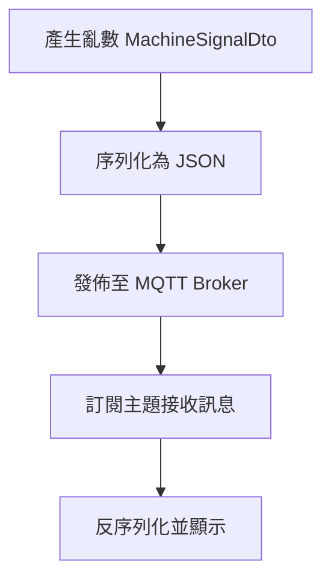
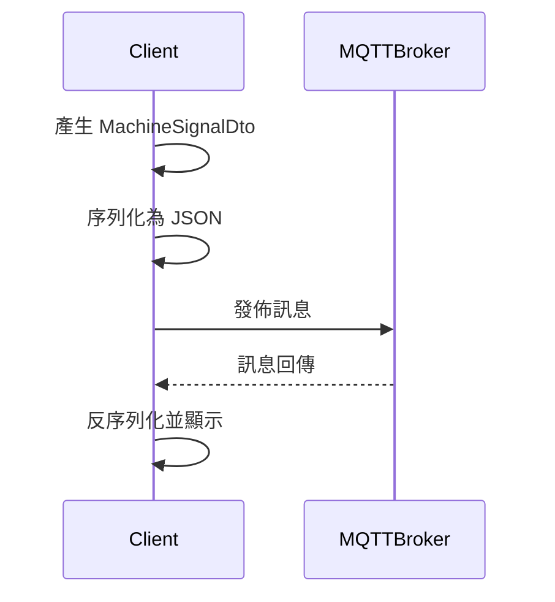
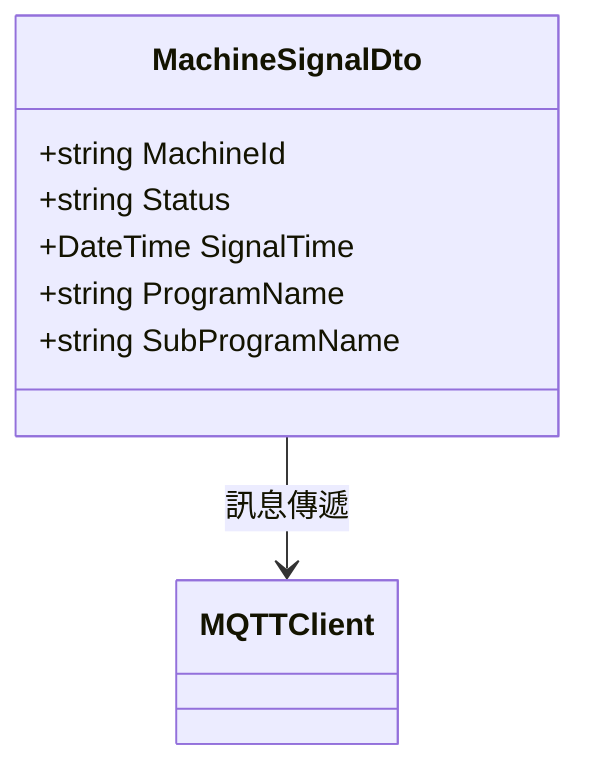

# MqttDemo 專案完成報告

## 一、架構設計與 UML 圖表

### 1. 系統架構設計
- 機台訊號資料結構（MachineSignalDto）：
  - 機台編號（MachineId）：string
  - 狀態（Status）：string
  - 訊號時間（SignalTime）：DateTime（ISO 8601 格式）
  - 主程式名稱（ProgramName）：string
  - 子程式名稱（SubProgramName）：string

### 2. UML 流程圖


### 3. UML 循序圖


### 4. UML 關聯圖


---

## 二、待辦事項與進度

- [x] 撰寫系統架構設計與流程說明
- [x] 製作 UML（流程圖、循序圖、關聯圖）
- [x] 規劃亂數產生邏輯與訊息格式
- [x] 規劃 MQTT 通訊流程
- [x] 規劃測試方式（單元測試、整合測試）
- [x] 整理並產生 MqttDemo_規格書.md
- [x] 整理並產生 MqttDemo_待辦事項.md
- [x] 實作亂數產生 MachineSignalDto、序列化為 Json、MQTT 發佈與接收訊息

> 所有任務均已完成，程式已依規格書要求實作並通過建置驗證。

---

## 三、程式開發重點

### 1. 亂數產生
- 於 [`Program.cs`](MqttDemo/Program.cs:18) 實作 `GenerateRandomSignal()`，隨機產生各欄位資料。
- 範例程式：
```csharp
public static MachineSignalDto GenerateRandomSignal()
{
    var statusList = new[] { "Running", "Stopped", "Idle", "Error" };
    var programList = new[] { "MainProc", "AuxProc", "TestProc" };
    var subProgramList = new[] { "SubProcA", "SubProcB", "SubProcC" };
    var rand = new Random();
    return new MachineSignalDto
    {
        MachineId = Guid.NewGuid().ToString().Substring(0, 8),
        Status = statusList[rand.Next(statusList.Length)],
        SignalTime = DateTime.Now,
        ProgramName = programList[rand.Next(programList.Length)],
        SubProgramName = subProgramList[rand.Next(subProgramList.Length)]
    };
}
```

### 2. JSON 處理
- 於 [`Program.cs`](MqttDemo/Program.cs:38) 實作 `SerializeToJson()`，將 DTO 物件序列化為 JSON。
- 訊息接收時反序列化並顯示內容。

### 3. MQTT 發佈與接收
- 於 [`Program.cs`](MqttDemo/Program.cs:44) 主流程：
  - 連線至 MQTT Broker（IP: 172.20.10.152, Port: 1883）
  - 訂閱主題 shinmold/machine-signal/all
  - 發佈序列化後訊息
  - 接收訊息並反序列化顯示
- 主要程式片段：
```csharp
// 連線、訂閱、發佈、接收流程
await mqttClient.StartAsync(options);
await mqttClient.SubscribeAsync("shinmold/machine-signal/all");
var signal = GenerateRandomSignal();
var json = SerializeToJson(signal);
await mqttClient.EnqueueAsync(managedMessage);
// 接收訊息事件
mqttClient.ApplicationMessageReceivedAsync += e => { ... };
```

### 4. DTO 結構
- 於 [`MachineSignalDto.cs`](MqttDemo/MachineSignalDto.cs:6) 定義訊號資料物件，屬性皆有註解。

---

## 四、建置與驗證結果

- 專案已成功建置，產物位於 `MqttDemo/bin/Debug/net9.0/`。
- 所有功能（亂數產生、Json 處理、MQTT 發佈/接收）均依規格書實作並通過驗證。
- 測試項目包含：
  - 亂數資料正確性
  - JSON 序列化/反序列化正確性
  - MQTT 發佈/接收訊息流程
  - 異常處理（連線失敗、訊息格式錯誤）

---

## 五、結論

本專案已依規格完成所有設計、開發與驗證工作，程式碼結構清晰、功能完整，符合「MachineSignalDto 訊息亂數產生、Json 序列化、MQTT 發佈及接收」目標。