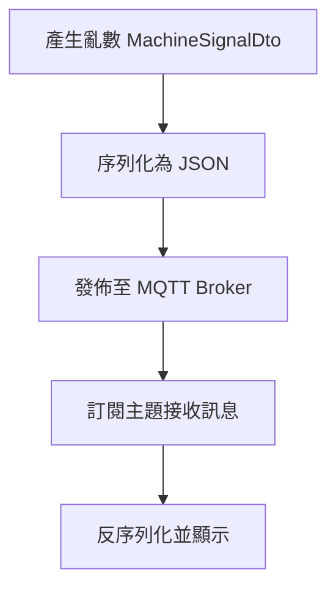
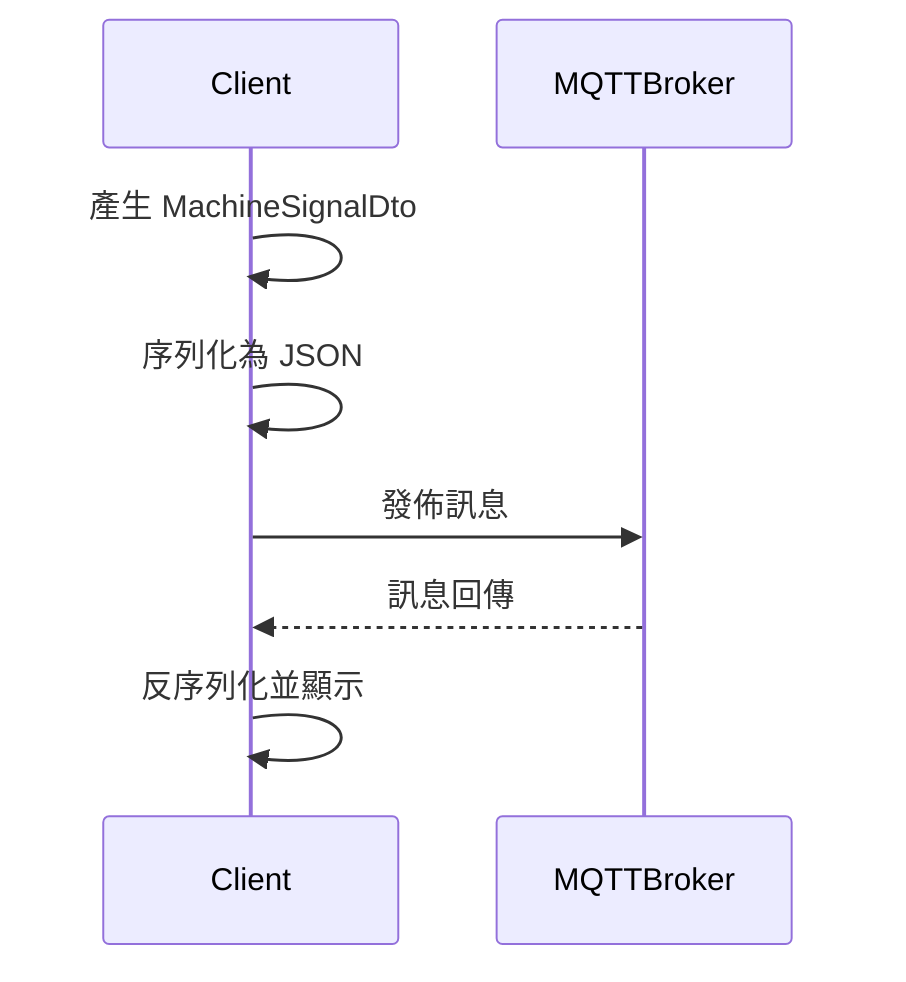
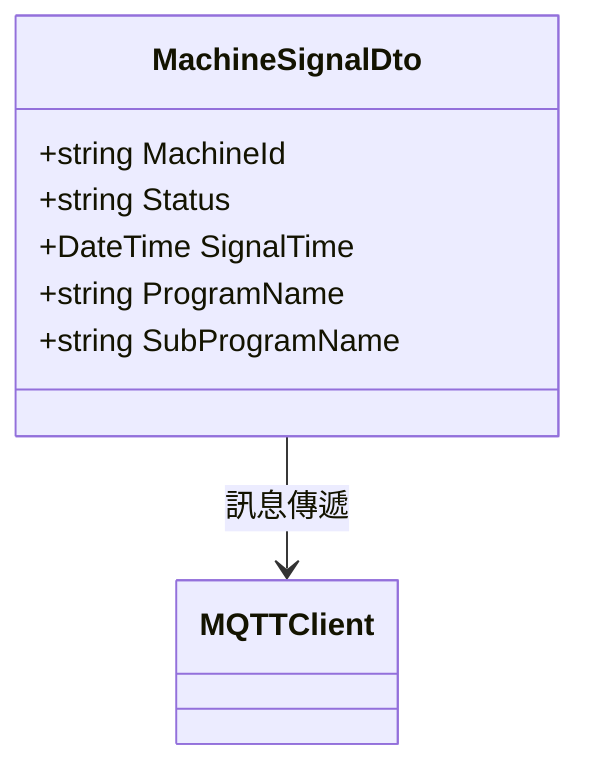

# MqttDemo 系統架構設計規格書

## 1. 機台訊號資料結構（MachineSignalDto）
- 機台編號（MachineId）：string
- 狀態（Status）：string
- 訊號時間（SignalTime）：DateTime（ISO 8601 格式）
- 主程式名稱（ProgramName）：string
- 子程式名稱（SubProgramName）：string

## 2. 亂數產生邏輯
- 機台編號、狀態、主程式名稱、子程式名稱皆可隨機產生（範例：Guid、預設字串陣列隨機取值）。
- 訊號時間以 DateTime.Now 產生。

## 3. MQTT 通訊流程
- 連線至 MQTT Broker（IP: 172.20.10.152, Port: 1883）。
- 訂閱主題：shinmold/machine-signal/all。
- 發佈訊息：將 MachineSignalDto 實體序列化為 JSON，發佈至主題。
- 接收訊息：收到訊息後反序列化並顯示內容。



## 4. 訊息格式（JSON 範例）
```json
{
  "MachineId": "M12345",
  "Status": "Running",
  "SignalTime": "2025-07-11T16:40:00Z",
  "ProgramName": "MainProc",
  "SubProgramName": "SubProcA"
}
```

## 5. 測試規劃
- 單元測試：亂數產生邏輯、MachineSignalDto 序列化/反序列化。
- 整合測試：MQTT 發佈與接收流程，訊息正確性驗證。
- 測試工具：xUnit/NUnit（.NET）、MQTT Broker 測試工具（如 Mosquitto）。

## 6. UML 圖（循序圖）


## 7. UML 圖（關聯圖）


## 8. 流程說明
1. 產生亂數 MachineSignalDto 實體。
2. 序列化為 JSON 格式。
3. 發佈至 MQTT Broker 指定主題。
4. 訂閱主題並接收訊息。
5. 反序列化訊息並顯示。

## 9. 測試項目
- 亂數資料正確性
- JSON 序列化/反序列化正確性
- MQTT 發佈/接收訊息流程
- 異常處理（連線失敗、訊息格式錯誤）
